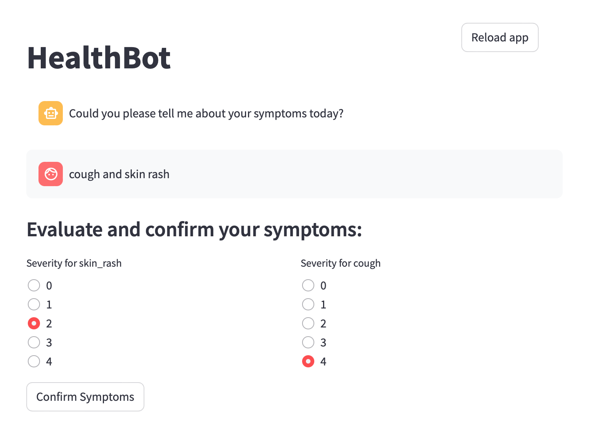

# HealthBot

HealthBot is a chatbot interface project (in development) designed to assist patients in describing their symptoms and receiving potential diagnoses / transmitting information to their healthcare provider. 
The chatbot will perform feature extraction, cross-references symptoms with a medical database, and provide predictions for possible diseases. It will also generate reports and handle patient history and ongoing treatments.

---
## Features

- **Chat Interface**: Users can interact with HealthBot by entering their symptoms and feelings. [**in progress**]
- **Feature Extraction**: Extracts key features from the user's input. [**in progress**]
- **Database Comparison**: Cross-references symptoms with a medical database for comparison. [**in progress**]
- **Predictions**: Provides predictions for potential diseases based on the user's symptoms. [to be build]
- **Symptom Extraction**: Identifies common symptoms not mentioned by the user, and provides symptoms by disease. [to be build]
- **Confirmation and Information Requests**: Asks for confirmation or additional information about predicted symptoms. [**in progress**]
- **Report Generation**: Generates a detailed report based on the user's input and the chatbot's analysis. [to be build]
- **Patient History and Ongoing Treatment**: Manages and queries patient history and ongoing treatments. [to be build]

---
## Images

<table>
  <tr>
    <td align="top"></td>
  </tr>
  <tr>
    <td align="center">Interface</td>
  </tr>
</table>

---
